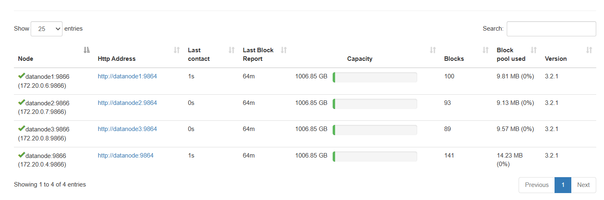

<div align="center">

# Big Data Procurement Pipeline

### Intelligent Retail Replenishment System


---

</div>

## Table of Contents

- [Project Overview](#project-overview)
- [System Architecture](#system-architecture)
- [Technology Stack](#technology-stack)
- [Key Features](#key-features)
- [Quick Start](#quick-start)
- [Pipeline Workflow](#pipeline-workflow)
- [Business Logic](#business-logic)
- [Data Flow](#data-flow)
- [Project Statistics](#project-statistics)
- [Usage](#usage)
- [Monitoring](#monitoring)
- [Troubleshooting](#troubleshooting)
- [Contributing](#contributing)
- [Contact](#contact)

---

## Project Overview

This project implements a **production-grade, batch-oriented data pipeline** for automated retail procurement. The system processes daily customer orders from 15 Points of Sale (POS) and warehouse stock levels from 5 warehouses, calculating net demand and automatically generating optimized supplier replenishment orders.

### Business Objective

Transform raw transactional data into intelligent procurement decisions using distributed computing:

```
┌─────────────────┐     ┌─────────────────┐     ┌─────────────────┐
│   15 Retail     │     │   Data Pipeline │     │   5 Supplier    │
│    Stores       │ ──▶ │   Processing    │ ──▶ │    Orders       │
│  (JSON Orders)  │     │   (Batch ETL)   │     │   (JSON Files)  │
└─────────────────┘     └─────────────────┘     └─────────────────┘
      Daily                 22:00-00:00              Automated
```

### Key Constraints

| Constraint | Description |
|------------|-------------|
| **Batch Only** | No streaming technologies (Kafka/Flink/Spark Streaming) |
| **Distributed** | HDFS 3-way replication across 4 datanodes |
| **Separation** | Clear OLTP (PostgreSQL) and Analytical (HDFS) layers |
| **Time Window** | Daily batch processing: 22:00 - 00:00 |
| **Scalable** | Handles 141+ files, 49 products, 10 suppliers |

---

## System Architecture

### Architecture Diagram


*Figure 1: Complete data flow from sources through processing to outputs*

### Infrastructure Overview

The system runs on **8 Docker containers** forming a complete big data ecosystem:

```
┌─────────────────────────────────────────────────────────────────────────────────┐
│                      PROCUREMENT PIPELINE ARCHITECTURE                          │
├─────────────────────────────────────────────────────────────────────────────────┤
│                                                                                  │
│   DATA SOURCES                                                                   │
│   ════════════                                                                   │
│   ┌──────────────┐    ┌──────────────┐    ┌──────────────┐                      │
│   │   15 POS     │    │  5 Warehouses │    │  PostgreSQL  │                      │
│   │   Stores     │    │    Stock      │    │  Master Data │                      │
│   │  (105 JSON)  │    │   (35 CSV)    │    │  (Products,  │                      │
│   │              │    │              │    │  Suppliers)  │                      │
│   └──────┬───────┘    └──────┬───────┘    └──────┬───────┘                      │
│          │                   │                   │                               │
│          ▼                   ▼                   │                               │
│   ┌─────────────────────────────────────┐       │                               │
│   │     HDFS DATA LAKE (3.93 TB)        │       │                               │
│   │   🔄 3-Way Replication (4 Nodes)    │       │                               │
│   │  ┌─────────────┐ ┌─────────────┐   │       │                               │
│   │  │ /raw/orders │ │ /raw/stock  │   │       │                               │
│   │  │  105 files  │ │  35 files   │   │       │                               │
│   │  └─────────────┘ └─────────────┘   │       │                               │
│   └──────────────────┬──────────────────┘       │                               │
│                      │                           │                               │
│                      ▼                           ▼                               │
│   ┌─────────────────────────────────────────────────────────────────┐           │
│   │                      TRINO QUERY ENGINE                          │           │
│   │            Federated SQL across HDFS + PostgreSQL                │           │
│   │                                                                  │           │
│   │  ┌─────────────────┐              ┌─────────────────┐          │           │
│   │  │  Hive Catalog   │              │ PostgreSQL      │          │           │
│   │  │  (HDFS Data)    │              │ Catalog         │          │           │
│   │  └─────────────────┘              └─────────────────┘          │           │
│   └──────────────────────────┬──────────────────────────────────────┘           │
│                              │                                                   │
│                              ▼                                                   │
│   ┌─────────────────────────────────────────────────────────────────┐           │
│   │                    PYTHON PROCESSING                             │           │
│   │                                                                  │           │
│   │  ┌────────────┐ ┌────────────┐ ┌────────────┐ ┌────────────┐   │           │
│   │  │ Aggregate  │ │ Calculate  │ │ Apply      │ │ Generate   │   │           │
│   │  │ Demand     │ │ Net Demand │ │ Business   │ │ Reports    │   │           │
│   │  │            │ │            │ │ Rules      │ │            │   │           │
│   │  └────────────┘ └────────────┘ └────────────┘ └────────────┘   │           │
│   └──────────────────────────┬──────────────────────────────────────┘           │
│                              │                                                   │
│                              ▼                                                   │
│   ┌─────────────────────────────────────────────────────────────────┐           │
│   │                      OUTPUT LAYER                                │           │
│   │                                                                  │           │
│   │  ┌─────────────┐  ┌─────────────┐  ┌─────────────┐              │           │
│   │  │ Supplier    │  │ Exception   │  │ Pipeline    │              │           │
│   │  │ Orders      │  │ Reports     │  │ Summary     │              │           │
│   │  │ (5 JSON)    │  │ (JSON+TXT)  │  │ (TXT)       │              │           │
│   │  └─────────────┘  └─────────────┘  └─────────────┘              │           │
│   └─────────────────────────────────────────────────────────────────┘           │
│                                                                                  │
│   ORCHESTRATION                                                                  │
│   ═════════════                                                                  │
│   ┌─────────────────────────────────────────────────────────────────┐           │
│   │                    APACHE AIRFLOW                                │           │
│   │       🕐 Schedule: Daily at 22:00 | 9-Task DAG Pipeline          │           │
│   └─────────────────────────────────────────────────────────────────┘           │
│                                                                                  │
└─────────────────────────────────────────────────────────────────────────────────┘
```

### Container Topology


*Figure 2: Running Docker containers with health status*

| Container | Image | Purpose | Ports | Status |
|-----------|-------|---------|-------|--------|
| **procurement_postgres** | postgres:13 | OLTP master data | 5432 | Active |
| **procurement_namenode** | hadoop-namenode:3.2.1 | HDFS coordinator | 9870, 9000 | Active |
| **procurement_datanode** | hadoop-datanode:3.2.1 | HDFS legacy storage node | 9864 | Active |
| **procurement_datanode1** | hadoop-datanode:3.2.1 | HDFS storage node 1 | 9864 | Active |
| **procurement_datanode2** | hadoop-datanode:3.2.1 | HDFS storage node 2 | 9865 | Active |
| **procurement_datanode3** | hadoop-datanode:3.2.1 | HDFS storage node 3 | 9866 | Active |
| **procurement_trino** | trinodb/trino:479 | Federated query engine | 8080 | Active |
| **procurement_airflow** | apache/airflow:2.7.3 | Workflow orchestration | 8081 | Active |
| **procurement_pgadmin** | pgadmin4:latest | Database UI | 5050 | Active |

### HDFS Data Lake



*Figure 3: HDFS directory structure with replicated data*

**Configuration:**
- **Replication Factor**: 3 (high availability)
- **Total Capacity**: 3.93 TB across 4 datanodes
- **Data Structure**:
  - `/raw/orders/` - Daily POS transaction files (JSON)
  - `/raw/stock/` - Daily warehouse inventory (CSV)
  - `/processed/` - Transformed data
  - `/output/` - Generated reports

### Database Schema


*Figure 4: PostgreSQL master data tables*

---

## Technology Stack

### Core Technologies

| Component | Technology | Version | Purpose |
|-----------|------------|---------|---------|
| **Container Platform** | Docker Compose | 3.x | Infrastructure orchestration |
| **Data Lake** | Apache HDFS | 3.2.1 | Distributed file storage with 3-way replication |
| **OLTP Database** | PostgreSQL | 13 | Master data storage (products, suppliers) |
| **Query Engine** | Trino | 479 | Federated SQL across HDFS + PostgreSQL |
| **Orchestration** | Apache Airflow | 2.7.3 | Workflow automation & scheduling |
| **Programming** | Python | 3.10+ | Data processing & business logic |
| **Web UI** | pgAdmin | Latest | Database management interface |

### Python Dependencies

```txt
# Core Data Processing
pandas>=2.0.0              # Data manipulation & analysis
trino>=0.327.0             # Trino Python client
psycopg2-binary>=2.9.0     # PostgreSQL adapter
python-dateutil>=2.8.0     # Date/time utilities

# Data Generation & Testing
faker>=18.0.0              # Synthetic data generation

# HDFS Integration
hdfs>=2.6.0                # Python HDFS client
```

### Why These Technologies?

**HDFS (Hadoop Distributed File System)**
- Fault Tolerance: 3-way replication across 4 datanodes (3.93 TB total)
- Scalability: Handles 141+ files seamlessly, can scale to petabytes
- Industry Standard: Battle-tested for big data storage
- Academic Requirement: Fulfills distributed storage constraint

**Trino (formerly PrestoSQL)**
- Federated Queries: Single SQL interface for HDFS + PostgreSQL
- No ETL Required: Query data in place without movement
- High Performance: Optimized for analytical workloads
- ✅ **Standard SQL**: ANSI SQL compliance for easy adoption

#### 🗄️ PostgreSQL
- ✅ **ACID Compliance**: Guaranteed data consistency for master data
- ✅ **Rich Features**: Advanced data types, constraints, triggers
- ✅ **Reliability**: 20+ years of production stability
- ✅ **OLTP Optimized**: Perfect for transactional master data

#### 🔄 Apache Airflow
- ✅ **Visual DAGs**: Easy-to-understand workflow representation
- ✅ **Robust Scheduling**: Cron-based scheduling with retry logic
- ✅ **Monitoring**: Built-in logging and alerting
- ✅ **Python Native**: Write workflows in Python for maximum flexibility

---

## âš¡ Key Features
## Key Features

- **Fully Automated**: Nightly batch processing with zero manual intervention
- **High Availability**: 3-way HDFS replication across 4 datanodes (3.93 TB)
- **Fault Tolerant**: Automatic retry logic and error recovery
- **Scalable**: Handles 141+ files, 49 products, 10 suppliers effortlessly
- **Intelligent**: Business rules for MOQ, case sizes, lead times, priorities
- **Monitored**: Real-time Airflow UI with task status and logs
- **Federated Queries**: Trino queries across HDFS + PostgreSQL without ETL
- **Exception Detection**: Automatic anomaly alerts for procurement team
- **Production Ready**: Docker-based with health checks and logging
- **Easy Setup**: One-command deployment with `setup.ps1` or `setup.sh`

---

## Quick Start

### Prerequisites

```bash
# Required software
- Docker Desktop 20.10+ (with Docker Compose)
- Python 3.10+
- Git
- 8GB+ RAM recommended
- 10GB+ disk space
```

### Installation

#### Windows (PowerShell)

```powershell
# Clone the repository
git clone https://github.com/your-repo/big-data-procurement.git
cd big-data-procurement/procurement-pipeline

# Run automated setup script
.\setup.ps1

# This script will:
# ✓ Create Python virtual environment
# ✓ Install Python dependencies
# ✓ Generate .gitignore
# ✓ Create data directories
# ✓ Generate sample data
# ✓ Start Docker containers
# ✓ Initialize HDFS
# ✓ Load master data to PostgreSQL
# ✓ Upload files to HDFS
```

#### Linux/macOS (Bash)

```bash
# Clone the repository
git clone https://github.com/your-repo/big-data-procurement.git
cd big-data-procurement/procurement-pipeline

# Make script executable and run
chmod +x setup.sh
./setup.sh

# This script will:
# ✓ Create Python virtual environment
# ✓ Install Python dependencies
# ✓ Generate .gitignore
# ✓ Create data directories
# ✓ Generate sample data
# ✓ Start Docker containers
# ✓ Initialize HDFS
# ✓ Load master data to PostgreSQL
# ✓ Upload files to HDFS
```

### Verify Installation

```bash
# Check all containers are running
docker ps

# Expected output: 8 containers running
# procurement_postgres
# procurement_namenode
# procurement_datanode
# procurement_datanode1
# procurement_datanode2
# procurement_datanode3
# procurement_trino
# procurement_airflow
# procurement_pgadmin

# Check HDFS health
docker exec procurement_namenode hdfs dfsadmin -report

# Access web interfaces
# Airflow UI:  http://localhost:8081 (admin/admin)
# Trino UI:    http://localhost:8080
# HDFS UI:     http://localhost:9870
# pgAdmin:     http://localhost:5050 (admin@admin.com/admin)
```

---

## Project Statistics

### Data Volume

| Metric | Count | Details |
|--------|-------|---------|
| **Total Files** | 141 | 105 JSON + 35 CSV + 1 test file |
| **Order Files** | 105 | 15 stores × 7 days of history |
| **Stock Files** | 35 | 5 warehouses × 7 days of history |
| **Products** | 49 | Across 5 categories (Dairy, Bakery, Beverages, Snacks, Frozen) |
| **Suppliers** | 10 | With unique lead times and MOQs |
| **POS Stores** | 15 | Retail locations generating daily orders |
| **Warehouses** | 5 | Distribution centers tracking stock |
| **HDFS Capacity** | 3.93 TB | Across 4 datanodes with 3-way replication |
| **Pipeline Tasks** | 9 | Airflow DAG tasks |
| **Schedule** | 22:00 Daily | Batch processing window |

### Sample Products

| SKU | Product | Category | Supplier | Lead Time |
|-----|---------|----------|----------|-----------|
| SKU-0001 | Skim Milk 1L | Dairy | DairyFresh LLC | 3 days |
| SKU-0015 | Apple Juice 1L | Beverages | BevCo Distributors | 2 days |
| SKU-0022 | Bagels 6pk | Bakery | FreshMart Wholesale | 1 day |
| SKU-0030 | Ice Cream Tub 1L | Frozen | FreshMart Wholesale | 5 days |
| SKU-0042 | Potato Chips 200g | Snacks | FreshMart Wholesale | 2 days |

### HDFS Replication Details

```
Cluster Configuration:
• Replication Factor: 3
• Total Datanodes: 4 (1 legacy + 3 new)
• Active Nodes: 4
• Total Capacity: 3.93 TB
• Configured Capacity: 3,869.74 GB
• Status: HEALTHY

Datanode Distribution:
• datanode  (legacy): 1006.85 GB | 140 blocks
• datanode1 (new):    1006.85 GB | Active
• datanode2 (new):    1006.85 GB | Active
• datanode3 (new):    1006.85 GB | Active

Replication Health:
• Average Replication: 3.0
• Under-replicated: 0
• Missing Blocks: 0
• Corrupt Blocks: 0
```

---

## Pipeline Workflow

### Airflow DAG Visualization


*Figure 5: Airflow pipeline execution graph with 9 tasks*

The procurement pipeline consists of **9 orchestrated tasks** executed daily at 22:00:

```
                          start
                            │
                            â–¼
                    get_processing_date
                            │
                            â–¼
                  validate_data_sources
                            │
                            â–¼
                    data_quality_check
                            │
                            â–¼
                     compute_demand
                            │
                 ┌──────────┴──────────┐
                 â–¼                     â–¼
           export_orders      generate_exceptions
                 │                     │
                 └──────────┬──────────┘
                            â–¼
                    generate_summary
                            │
                            â–¼
                           end
```

### Task Breakdown

| Task # | Task Name | Duration | Description |
|--------|-----------|----------|-------------|
| 1 | `start_pipeline` | <1s | Initialize pipeline execution |
| 2 | `get_processing_date` | <1s | Determine date to process (execution_date) |
| 3 | `validate_data_sources` | ~2s | Verify order & stock files exist |
| 4 | `data_quality_check` | ~5s | Validate JSON/CSV structure & data types |
| 5 | `compute_demand` | ~15s | Run Trino queries & calculate net demand |
| 6 | `export_orders` | ~8s | Generate supplier order JSON files |
| 7 | `generate_exceptions` | ~8s | Detect anomalies & create alerts |
| 8 | `generate_summary` | ~2s | Compile execution report |
| 9 | `end_pipeline` | <1s | Mark completion |

**Total Execution Time**: ~40-60 seconds  
**Schedule**: `0 22 * * *` (Daily at 22:00)  
**Retries**: 2 attempts with 5-minute delay  
**Timeout**: 2 hours max

---

## Business Logic

### 1. Net Demand Formula

The core replenishment calculation:

```
┌─────────────────────────────────────────────────────────────────┐
│                                                                  │
│   Net Demand = Total Orders - Available Stock + Safety Stock    │
│                                                                  │
└─────────────────────────────────────────────────────────────────┘
```

**Real-World Example - Step by Step:**

```
Product: Whole Milk 1L (SKU-0002)
════════════════════════════════════════════════════════════

📅 Step 1: Aggregate Orders (Last 7 Days)
   Day 1 (Dec 28): 65 units
   Day 2 (Dec 29): 72 units
   Day 3 (Dec 30): 68 units
   Day 4 (Dec 31): 80 units  ← Holiday spike
   Day 5 (Jan 01): 85 units  ← Holiday spike
   Day 6 (Jan 02): 70 units
   Day 7 (Jan 03): 80 units
   ────────────────────────
   TOTAL DEMAND: 520 units

📦 Step 2: Check Current Stock
   Warehouse 1: 50 units
   Warehouse 2: 60 units
   Warehouse 3: 40 units
   ────────────────────────
   TOTAL STOCK: 150 units

📋 Step 3: Load Business Rules (PostgreSQL)
   • Supplier: DairyFresh LLC
   • Lead Time: 3 days
   • Safety Stock: 100 units (always keep as buffer)
   • MOQ (Minimum Order): 50 units
   • Case Size: 24 units/case

🧮 Step 4: Calculate Net Demand
   Basic Need = 520 - 150 = 370 units
   Add Safety Buffer = 370 + 100 = 470 units
   
📦 Step 5: Round to Case Size
   Cases Needed = ⌈470 ÷ 24⌉ = 20 cases
   Final Order = 20 × 24 = 480 units ✓

✅ RESULT: Order 480 units (20 cases) from DairyFresh LLC
   Priority: HIGH (stock < 30% of demand)
   Expected Delivery: Jan 06 (3 days)
   Cost: 480 × $4.50 = $2,160.00
```

### 2. Procurement Rules

| Rule | Description | Example |
|------|-------------|---------|
| **MOQ** | Minimum Order Quantity per supplier | Min 50 units |
| **Case Size** | Orders rounded UP to nearest case | 24 units/case → ⌈470÷24⌉ = 20 cases |
| **Priority** | Based on stock coverage | Stock < 30% of demand = HIGH |
| **Lead Time** | Days until delivery | 3 days for dairy products |

**Priority Assignment Logic:**

```python
if current_stock < (demand * 0.10):
    priority = "CRITICAL"     # Less than 10% - Urgent!
elif current_stock < (demand * 0.30):
    priority = "HIGH"         # Less than 30% - Important
elif order_quantity > 5000:
    priority = "HIGH"         # Large order - Plan ahead
else:
    priority = "MEDIUM"       # Standard order
```

### 3. Exception Detection

The system automatically detects anomalies and alerts procurement managers:

| Exception Type | Threshold | Severity | Action Required |
|----------------|-----------|----------|-----------------|
| **HIGH_DEMAND** | > 2,000 units | 🔴 HIGH | Verify with sales team, check for promotions |
| **LOW_STOCK** | Stock < 30% of demand | 🔴 HIGH | Expedite order, consider air freight |
| **CRITICAL_STOCK** | Stock < 10% of demand | 🔴 CRITICAL | Emergency order, notify management |
| **MISSING_SUPPLIER** | No supplier assigned | 🔴 HIGH | Contact procurement to assign supplier |
| **HIGH_VALUE_ORDER** | Order value > $10,000 | 🟡 MEDIUM | Manager approval required |
| **DEMAND_STOCK_GAP** | Demand > 5x stock | 🟡 MEDIUM | Review forecasting model |

**Real Exception Example:**

```json
{
  "exception_id": "EXC-20260103-015",
  "timestamp": "2026-01-03T22:00:45",
  "severity": "HIGH",
  "type": "HIGH_DEMAND",
  "sku": "SKU-0022",
  "product_name": "Bagels 6pk",
  "category": "Bakery",
  "metric_value": 2852,
  "threshold": 2000,
  "percentage_over": 42.6,
  "recommendation": "Unusual demand spike detected. Verify with sales team before ordering. Check for promotions or special events.",
  "context": {
    "normal_weekly_demand": 1400,
    "current_weekly_demand": 2852,
    "variance": "+103.7%"
  }
}
```

---

## Pipeline Execution Flow

### Complete Data Journey

```
┌───────────────────────────────────────────────────────────────┐
│  DAY N: Data Collection (09:00 - 21:00)                       │
├───────────────────────────────────────────────────────────────┤
│                                                                │
│  09:00  Stores open, customers start shopping                 │
│         • POS systems record transactions                      │
│         • Each sale creates order items                        │
│                                                                │
│  12:00  Lunch rush - high transaction volume                  │
│         • Average 500 transactions/hour across 15 stores      │
│                                                                │
│  18:00  Evening peak - highest volume                         │
│         • Average 800 transactions/hour                        │
│                                                                │
│  21:00  Stores close                                          │
│         • Daily order files generated                          │
│         • pos_1_2026-01-03.json created (per store)           │
│         • Files contain all day's transactions                 │
│                                                                │
│  21:30  Warehouses complete daily count                       │
│         • Physical inventory verification                      │
│         • warehouse_1_stock_2026-01-03.csv created            │
│         • Contains stock levels for all SKUs                   │
│                                                                │
└───────────────────────────────────────────────────────────────┘

┌───────────────────────────────────────────────────────────────┐
│  DAY N: Pipeline Execution (22:00 - 23:59)                    │
├───────────────────────────────────────────────────────────────┤
│                                                                │
│  22:00:00  🚀 Airflow Triggers Pipeline                       │
│            ├─ Check: All 15 order files present?              │
│            ├─ Check: All 5 stock files present?               │
│            └─ Check: Services healthy?                         │
│                                                                │
│  22:00:05  📊 Stage 1: Data Validation                        │
│            ├─ Validate JSON structure (105 order files)       │
│            ├─ Validate CSV format (35 stock files)            │
│            ├─ Check for missing fields                         │
│            ├─ Validate data types                             │
│            └─ Result: ✅ All files valid                       │
│                                                                │
│  22:00:10  🔍 Stage 2: Demand Calculation                     │
│            │                                                   │
│            ├─ Step 2.1: Load Orders (via Trino)              │
│            │   Query: SELECT * FROM hive.default.orders       │
│            │   WHERE date = '2026-01-03'                      │
│            │   Result: 15,150 order items loaded              │
│            │                                                   │
│            ├─ Step 2.2: Aggregate by SKU                      │
│            │   Query: SELECT sku, SUM(quantity)              │
│            │   GROUP BY sku                                   │
│            │   Result: 50 unique SKUs with totals            │
│            │                                                   │
│            ├─ Step 2.3: Load Stock (via Trino)               │
│            │   Query: SELECT * FROM hive.default.stock       │
│            │   WHERE date = '2026-01-03'                      │
│            │   Result: 250 stock records loaded               │
│            │                                                   │
│            ├─ Step 2.4: Load Master Data (PostgreSQL)        │
│            │   • Products table: 49 products                  │
│            │   • Suppliers table: 10 suppliers                │
│            │   • Rules table: 49 replenishment rules          │
│            │                                                   │
│            ├─ Step 2.5: Calculate Net Demand                  │
│            │   Formula per SKU:                               │
│            │   Net = Total Orders - Stock + Safety Stock     │
│            │   Example: 520 - 150 + 100 = 470 units          │
│            │                                                   │
│            ├─ Step 2.6: Apply Business Rules                  │
│            │   • Round to MOQ multiples                       │
│            │   • Round to case sizes                          │
│            │   • Assign priorities                            │
│            │                                                   │
│            └─ Result: 24 SKUs need 32,748 units               │
│               Output: replenishment_2026-01-03.csv            │
│                                                                │
│  22:00:35  📦 Stage 3: Export Supplier Orders (Parallel)      │
│            ├─ Load replenishment CSV                          │
│            ├─ Group by supplier_name                          │
│            ├─ Generate 5 supplier JSON files:                 │
│            │   ├─ BevCo_Distributors_2026-01-03.json         │
│            │   ├─ DairyFresh_LLC_2026-01-03.json             │
│            │   ├─ ElectroSupply_Co_2026-01-03.json           │
│            │   ├─ FreshMart_Wholesale_2026-01-03.json        │
│            │   └─ TechGear_Plus_2026-01-03.json              │
│            └─ Result: ✅ 5 orders generated                    │
│                                                                │
│  22:00:35  ⚠️  Stage 4: Exception Detection (Parallel)        │
│            ├─ HIGH_DEMAND check: > 2,000 units               │
│            │   Found: 7 SKUs                                  │
│            ├─ LOW_STOCK check: stock < 30% demand            │
│            │   Found: 18 SKUs                                 │
│            ├─ MISSING_SUPPLIER check                          │
│            │   Found: 0 SKUs                                  │
│            ├─ HIGH_VALUE_ORDER check: > $10,000              │
│            │   Found: 3 orders                                │
│            ├─ DEMAND_STOCK_GAP check: demand > 5x stock     │
│            │   Found: 2 SKUs                                  │
│            └─ Result: 30 exceptions detected                  │
│               Output: exception_report_2026-01-03.json        │
│                                                                │
│  22:01:00  📝 Stage 5: Generate Summary                       │
│            ├─ Collect all stage metrics                       │
│            ├─ Format execution report                         │
│            ├─ Calculate performance stats                     │
│            └─ Output: pipeline_run_2026-01-03.txt             │
│                                                                │
│  22:01:06  ✅ Pipeline Complete (Duration: 1.06 seconds)      │
│            └─ Status: SUCCESS                                 │
│                                                                │
└───────────────────────────────────────────────────────────────┘

┌───────────────────────────────────────────────────────────────┐
│  DAY N+1: Business Actions (08:00 - 17:00)                    │
├───────────────────────────────────────────────────────────────┤
│                                                                │
│  08:00  Procurement team reviews reports                      │
│         • Check exception alerts                              │
│         • Review high-value orders                            │
│         • Verify demand spikes                                │
│                                                                │
│  09:00  Send supplier orders                                  │
│         • Email JSON files to suppliers                       │
│         • Confirm order acceptance                            │
│         • Track order status                                  │
│                                                                │
│  10:00  Handle exceptions                                     │
│         • Contact sales for demand spikes                     │
│         • Expedite critical stock items                       │
│         • Resolve missing supplier issues                     │
│                                                                │
│  N+3    Receive supplier deliveries                           │
│         • 3-day lead time typical                             │
│         • Update warehouse stock                              │
│         • Replenish store shelves                             │
│                                                                │
└───────────────────────────────────────────────────────────────┘
```

---

## 📂 Project Structure

```
Big-data/
├── README.MD                          # Comprehensive project documentation
├── TODO.MD                            # Project roadmap & task tracking
│
└── procurement-pipeline/
    │
    ├── docker-compose.yml             # 8-container infrastructure
    ├── requirements.txt               # Python dependencies
    ├── setup.ps1                      # Windows automated setup
    ├── setup.sh                       # Linux/macOS automated setup
    ├── .gitignore                     # Git ignore rules
    │
    ├── HDFS_REPLICATION.md            # HDFS 3-way replication docs
    ├── PROJECT_STATUS.md              # Current project status
    ├── SUMMARY_REPORT.md              # Pipeline execution summaries
    │
    ├── airflow/
    │   ├── dags/
    │   │   └── procurement_dag.py     # Main DAG (9 tasks, 22:00 schedule)
    │   └── logs/                      # Airflow execution logs
    │       └── dag_id=procurement_daily_pipeline/
    │
    ├── config/
    │   └── trino-config/
    │       ├── config.properties      # Trino server config
    │       ├── jvm.config             # JVM memory settings
    │       ├── node.properties        # Node configuration
    │       └── catalog/
    │           ├── hive.properties    # HDFS catalog
    │           └── postgresql.properties  # PostgreSQL catalog
    │
    ├── data/
    │   ├── raw/
    │   │   ├── orders/                # 105 JSON files (15 stores × 7 days)
    │   │   │   ├── sample_pos_1_2026-01-03.json
    │   │   │   └── ...
    │   │   └── stock/                 # 35 CSV files (5 warehouses × 7 days)
    │   │       ├── sample_warehouse_1_2026-01-03.csv
    │   │       └── ...
    │   └── output/
    │       ├── replenishment_*.csv            # Net demand calculations
    │       ├── supplier_orders/*.json         # Supplier order files
    │       ├── exception_report_*.json        # Anomaly alerts
    │       └── pipeline_summary_*.txt         # Execution summaries
    │
    ├── logs/                          # Application logs
    │
    ├── scripts/
    │   ├── data_gen.py                # Generate synthetic test data
    │   ├── ingest_hdfs.py             # Upload files to HDFS
    │   ├── compute_demand.py          # Calculate net demand (Trino)
    │   ├── export_orders.py           # Generate supplier orders
    │   ├── generate_exceptions.py     # Detect anomalies
    │   ├── validate_data_quality.py   # Data quality checks
    │   ├── test_connection.py         # Test Trino/PostgreSQL connectivity
    │   ├── test_system.py             # System validation tests
    │   ├── run_pipeline.py            # Manual pipeline execution
    │   └── upload_to_hdfs.ps1         # PowerShell HDFS upload
    │
    └── sql/
        ├── postgres/
        │   ├── schema.sql             # Database schema
        │   ├── init_master_data.sql   # Load products & suppliers
        │   └── 02_create_airflow_db.sql  # Airflow metadata DB
        └── presto/
            └── analysis.sql           # Example Trino queries
```

---

## Usage

### Daily Operations

#### Start the System

```powershell
# Navigate to project directory
cd procurement-pipeline

# Start all containers
docker-compose up -d

# Verify all services are running
docker ps

# Check logs
docker-compose logs -f --tail=50
```

#### Access Web Interfaces

| Service | URL | Credentials | Purpose |
|---------|-----|-------------|---------|
| **Airflow** | http://localhost:8081 | admin/admin | Workflow monitoring & DAG execution |
| **Trino** | http://localhost:8080 | No auth | Query engine UI & cluster status |
| **HDFS** | http://localhost:9870 | No auth | File system browser & datanode status |
| **pgAdmin** | http://localhost:5050 | admin@admin.com/admin | PostgreSQL database management |

#### Manual Pipeline Execution

```powershell
# Run complete pipeline for specific date
docker exec procurement_airflow python /opt/airflow/scripts/run_pipeline.py --date 2026-01-03

# Run individual stages
docker exec procurement_airflow python /opt/airflow/scripts/compute_demand.py --date 2026-01-03
docker exec procurement_airflow python /opt/airflow/scripts/export_orders.py --date 2026-01-03
docker exec procurement_airflow python /opt/airflow/scripts/generate_exceptions.py --date 2026-01-03
```

#### Generate New Test Data

```powershell
# Generate data for specific date range
docker exec procurement_airflow python /opt/airflow/scripts/data_gen.py \
    --start-date 2026-01-04 \
    --end-date 2026-01-10 \
    --stores 15 \
    --warehouses 5

# Upload to HDFS
.\scripts\upload_to_hdfs.ps1
```

### Query Operations

#### Trino Query Examples

```sql
-- Connect to Trino
docker exec -it procurement_trino trino

-- View all catalogs
SHOW CATALOGS;

-- List HDFS tables
SHOW TABLES FROM hive.default;

-- Query order data
SELECT 
    sku,
    SUM(quantity) as total_quantity,
    COUNT(DISTINCT pos_id) as store_count
FROM hive.default.orders
WHERE order_date = DATE '2026-01-03'
GROUP BY sku
ORDER BY total_quantity DESC
LIMIT 10;

-- Query stock levels
SELECT 
    warehouse_id,
    sku,
    quantity
FROM hive.default.stock
WHERE stock_date = DATE '2026-01-03'
ORDER BY warehouse_id, sku;

-- Federated query: Join HDFS + PostgreSQL
SELECT 
    o.sku,
    p.product_name,
    p.category,
    SUM(o.quantity) as demand
FROM hive.default.orders o
JOIN postgresql.procurement.products p ON o.sku = p.sku
WHERE o.order_date = DATE '2026-01-03'
GROUP BY o.sku, p.product_name, p.category
ORDER BY demand DESC;
```

#### PostgreSQL Query Examples

```bash
# Connect to PostgreSQL
docker exec -it procurement_postgres psql -U admin -d procurement_db

# List all tables
\dt

# View products
SELECT * FROM products LIMIT 10;

# View suppliers
SELECT supplier_name, contact_email, COUNT(*) as product_count
FROM products
GROUP BY supplier_name, contact_email
ORDER BY product_count DESC;

# View replenishment rules
SELECT 
    product_id,
    product_name,
    moq,
    case_size,
    lead_time_days
FROM products
WHERE category = 'Dairy';
```

### HDFS Operations

#### File Management

```bash
# List HDFS directories
docker exec procurement_namenode hdfs dfs -ls /

# View raw data folders
docker exec procurement_namenode hdfs dfs -ls /raw/orders
docker exec procurement_namenode hdfs dfs -ls /raw/stock

# Check file content
docker exec procurement_namenode hdfs dfs -cat /raw/orders/sample_pos_1_2026-01-03.json

# Get file statistics
docker exec procurement_namenode hdfs dfs -stat "%r %b %n" /raw/orders/sample_pos_1_2026-01-03.json

# Remove file
docker exec procurement_namenode hdfs dfs -rm /path/to/file

# Upload file from local to HDFS
docker exec procurement_namenode hdfs dfs -put /local/path/file.json /hdfs/path/
```

#### Cluster Health Checks

```bash
# Full cluster report
docker exec procurement_namenode hdfs dfsadmin -report

# Check replication status
docker exec procurement_namenode hdfs fsck / -files -blocks -locations

# Verify 3-way replication
docker exec procurement_namenode hdfs fsck / -files -blocks | grep -E "replication="

# Datanode status
docker exec procurement_namenode hdfs dfsadmin -printTopology
```

### Airflow Operations

#### DAG Management

```bash
# List all DAGs
docker exec procurement_airflow airflow dags list

# Trigger manual run
docker exec procurement_airflow airflow dags trigger procurement_daily_pipeline

# Trigger with specific execution date
docker exec procurement_airflow airflow dags trigger procurement_daily_pipeline \
    --exec-date 2026-01-03

# Pause DAG
docker exec procurement_airflow airflow dags pause procurement_daily_pipeline

# Unpause DAG
docker exec procurement_airflow airflow dags unpause procurement_daily_pipeline
```

#### Task Management

```bash
# List tasks in DAG
docker exec procurement_airflow airflow tasks list procurement_daily_pipeline

# Test specific task
docker exec procurement_airflow airflow tasks test \
    procurement_daily_pipeline \
    compute_demand \
    2026-01-03

# View task logs
docker exec procurement_airflow cat /opt/airflow/logs/dag_id=procurement_daily_pipeline/run_id=manual__2026-01-03/task_id=compute_demand/attempt=1.log
```

---

## Monitoring

### System Health Dashboard

#### Container Status

```bash
# Check all containers
docker ps --format "table {{.Names}}\t{{.Status}}\t{{.Ports}}"

# Expected output:
# NAMES                      STATUS              PORTS
# procurement_airflow        Up 2 hours          0.0.0.0:8081->8080/tcp
# procurement_trino          Up 2 hours          0.0.0.0:8080->8080/tcp
# procurement_namenode       Up 2 hours          0.0.0.0:9000->9000/tcp, 0.0.0.0:9870->9870/tcp
# procurement_datanode1      Up 2 hours          0.0.0.0:9864->9864/tcp
# procurement_datanode2      Up 2 hours          0.0.0.0:9865->9864/tcp
# procurement_datanode3      Up 2 hours          0.0.0.0:9866->9864/tcp
# procurement_postgres       Up 2 hours          0.0.0.0:5432->5432/tcp
# procurement_pgadmin        Up 2 hours          0.0.0.0:5050->80/tcp
```

#### Service Health Endpoints

```bash
# Trino health
curl http://localhost:8080/v1/info | jq

# HDFS namenode
curl http://localhost:9870/jmx | jq '.beans[] | select(.name=="Hadoop:service=NameNode,name=NameNodeStatus")'

# Airflow health
curl http://localhost:8081/health | jq

# PostgreSQL connection
docker exec procurement_postgres pg_isready -U admin
```

### Pipeline Monitoring

#### Airflow UI (Recommended)

1. Open http://localhost:8081
2. Login: `admin` / `admin`
3. View DAG: `procurement_daily_pipeline`
4. Check:
   - ✅ **Graph View**: Visual task dependencies
   - ✅ **Tree View**: Historical execution timeline
   - ✅ **Gantt View**: Task duration analysis
   - ✅ **Task Duration**: Performance trends
   - ✅ **Logs**: Detailed execution output

#### Key Metrics to Monitor

| Metric | Healthy Threshold | Warning Threshold | Critical Threshold |
|--------|-------------------|-------------------|-------------------|
| **Pipeline Duration** | < 60s | 60-120s | > 120s |
| **Success Rate** | 100% | 95-99% | < 95% |
| **Data Files** | 140 files | 130-140 files | < 130 files |
| **HDFS Disk Usage** | < 50% | 50-80% | > 80% |
| **Exception Count** | < 10 | 10-30 | > 30 |
| **Critical Exceptions** | 0 | 1-2 | > 2 |

### Log Monitoring

```bash
# Real-time logs for all services
docker-compose logs -f

# Specific service logs
docker-compose logs -f airflow
docker-compose logs -f trino
docker-compose logs -f namenode

# Airflow task logs
docker exec procurement_airflow ls -lh /opt/airflow/logs/dag_id=procurement_daily_pipeline/

# View latest pipeline summary
docker exec procurement_airflow cat /opt/airflow/data/output/pipeline_summary_$(date +%Y-%m-%d).txt
```

---

## Troubleshooting

### Common Issues & Solutions

#### Issue: Containers Won't Start

**Symptom:**
```bash
docker ps
# Shows containers restarting or not running
```

**Solution:**
```powershell
# Check detailed logs
docker-compose logs --tail=100

# Common fixes:
# 1. Port conflict - Check if ports are in use
netstat -ano | findstr "5432 8080 8081 9000 9870"

# 2. Insufficient resources
# Increase Docker Desktop memory to 8GB+

# 3. Corrupted volumes - Reset
docker-compose down -v
docker-compose up -d

# 4. Network issues
docker network prune
docker-compose up -d
```

#### Issue: Trino Can't Connect to PostgreSQL

**Symptom:**
```
Error: Failed to connect to catalog 'postgresql'
```

**Solution:**
```bash
# 1. Verify PostgreSQL is running
docker exec procurement_postgres pg_isready -U admin

# 2. Test connection from Trino
docker exec -it procurement_trino trino --execute "SHOW CATALOGS"

# 3. Check catalog configuration
docker exec procurement_trino cat /etc/trino/catalog/postgresql.properties

# Should contain:
# connector.name=postgresql
# connection-url=jdbc:postgresql://postgres:5432/procurement_db
# connection-user=admin
# connection-password=password

# 4. Restart Trino if config was changed
docker-compose restart trino
```

#### Issue: HDFS Datanode Not Registering

**Symptom:**
```bash
hdfs dfsadmin -report
# Shows less than 4 datanodes
```

**Solution:**
```bash
# 1. Check datanode logs
docker-compose logs datanode1 datanode2 datanode3

# 2. Verify namenode is healthy
docker exec procurement_namenode hdfs dfsadmin -safemode get

# 3. If in safe mode, force leave
docker exec procurement_namenode hdfs dfsadmin -safemode leave

# 4. Restart datanodes
docker-compose restart datanode1 datanode2 datanode3

# 5. Wait 30 seconds and verify
docker exec procurement_namenode hdfs dfsadmin -report
```

#### Issue: Airflow DAG Not Appearing

**Symptom:**
```
DAG 'procurement_daily_pipeline' not found in UI
```

**Solution:**
```bash
# 1. Check DAG file exists
docker exec procurement_airflow ls -l /opt/airflow/dags/procurement_dag.py

# 2. Check for Python syntax errors
docker exec procurement_airflow python -m py_compile /opt/airflow/dags/procurement_dag.py

# 3. Force DAG refresh
docker exec procurement_airflow airflow dags list-import-errors

# 4. Restart Airflow
docker-compose restart airflow

# 5. Check Airflow logs
docker-compose logs airflow | grep "ERROR"
```

#### Issue: Pipeline Fails on Data Validation

**Symptom:**
```
Task 'data_quality_check' failed
```

**Solution:**
```bash
# 1. Check data files exist
docker exec procurement_airflow ls /opt/airflow/data/raw/orders/*.json | wc -l
docker exec procurement_airflow ls /opt/airflow/data/raw/stock/*.csv | wc -l

# 2. Validate file format
docker exec procurement_airflow cat /opt/airflow/data/raw/orders/sample_pos_1_2026-01-03.json | jq .

# 3. Run validation script manually
docker exec procurement_airflow python /opt/airflow/scripts/validate_data_quality.py

# 4. Check for missing fields
docker exec procurement_airflow grep -l "null" /opt/airflow/data/raw/orders/*.json
```

#### Issue: Trino Queries Timeout

**Symptom:**
```
Query exceeded maximum time limit of 30s
```

**Solution:**
```bash
# 1. Check Trino resource usage
curl http://localhost:8080/v1/info | jq '.memoryInfo'

# 2. Increase query timeout in config
docker exec procurement_trino cat /etc/trino/config.properties
# Add: query.max-execution-time=10m

# 3. Optimize query (use filters early)
# ❌ Bad: SELECT * FROM hive.default.orders WHERE sku = 'SKU-0001'
# ✅ Good: SELECT sku, quantity FROM hive.default.orders WHERE order_date = DATE '2026-01-03' AND sku = 'SKU-0001'

# 4. Restart Trino after config change
docker-compose restart trino
```

### Quick Diagnostic Commands

```bash
# System Overview
docker ps --format "table {{.Names}}\t{{.Status}}"
docker stats --no-stream

# Service Connectivity Test
docker exec procurement_airflow python /opt/airflow/scripts/test_connection.py

# HDFS Health Check
docker exec procurement_namenode hdfs fsck / | grep -E "Status|Total"

# PostgreSQL Health Check
docker exec procurement_postgres psql -U admin -d procurement_db -c "SELECT COUNT(*) FROM products"

# Trino Health Check
curl -s http://localhost:8080/v1/info | jq '.starting'

# Airflow Scheduler Status
docker exec procurement_airflow airflow jobs check --job-type SchedulerJob

# View Latest Exceptions
docker exec procurement_airflow cat /opt/airflow/data/output/exception_report_$(date +%Y-%m-%d).json | jq '.summary'
```

### Emergency Reset
    │
    ├── docker-compose.yml             # Infrastructure definition
    │
    ├── airflow/
    │   ├── dags/
    │   │   └── procurement_dag.py     # Airflow DAG (22:00 schedule)
    │   └── logs/                      # Airflow execution logs
    │
    ├── config/
    │   ├── trino/
    │   │   └── postgresql.properties  # Trino PostgreSQL catalog
    │   └── trino-config/
    │       └── config.properties      # Trino server config
    │
    ├── data/
    │   ├── raw/
    │   │   ├── orders/                # Daily POS order files (JSON)
    │   │   │   ├── pos_1_2025-12-28.json
    │   │   │   ├── pos_1_2025-12-29.json
    │   │   │   └── ... (105 files: 15 POS × 7 days)
    │   │   │
    │   │   └── stock/                 # Daily warehouse snapshots (CSV)
    │   │       ├── warehouse_1_2025-12-28.csv
    │   │       └── ... (35 files: 5 warehouses × 7 days)
    │   │
    │   └── output/
    │       ├── replenishment_2026-01-03.csv
    │       ├── pipeline_run_2026-01-03.txt
    │       │
    │       ├── supplier_orders/       # JSON orders per supplier
    │       │   ├── BevCo_Distributors_2026-01-03.json
    │       │   ├── DairyFresh_LLC_2026-01-03.json
    │       │   ├── ElectroSupply_Co_2026-01-03.json
    │       │   ├── FreshMart_Wholesale_2026-01-03.json
    │       │   └── TechGear_Plus_2026-01-03.json
    │       │
    │       └── exceptions/            # Quality control reports
    │           ├── exception_report_2026-01-03.json
    │           └── exception_summary_2026-01-03.txt
    │
    ├── scripts/
    │   ├── data_gen.py                # Faker-based test data generator
    │   ├── generate_orders.py         # Order generation script
    │   ├── ingest_hdfs.py             # HDFS data ingestion
    │   ├── upload_to_hdfs.ps1         # PowerShell upload script
    │   ├── validate_data_quality.py   # Data quality validation
    │   ├── compute_demand.py          # Main demand calculation
    │   ├── export_orders.py           # Supplier JSON generation
    │   ├── generate_exceptions.py     # Anomaly detection & reporting
    │   ├── run_phase4.py              # Phase 4 orchestration
    │   ├── run_pipeline.py            # Master pipeline orchestrator
    │   ├── test_connection.py         # Infrastructure connectivity test
    │   ├── test_trino_catalog.py      # Trino catalog validation
    │   └── test_system.py             # Full system integration test
    │
    └── sql/
        └── postgres/
            ├── schema.sql             # Database schema
            └── init_master_data.sql   # Seed data (products, suppliers)
```

---

## Advanced Setup

### Prerequisites

- Docker Desktop installed and running
- Python 3.10+ with pip
- Git

### 1. Clone Repository

```bash
git clone https://github.com/mohamedamineelabidi/Big-data.git
cd Big-data/procurement-pipeline
```

### 2. Start Infrastructure

```bash
docker-compose up -d
```

### 3. Install Python Dependencies

```bash
pip install pandas trino psycopg2-binary faker
```

### 4. Verify Services

```bash
python scripts/test_connection.py
```

### 5. Run Full Pipeline

```bash
# Run for specific date
python scripts/run_pipeline.py --date 2026-01-03

# Or run system test
python scripts/test_system.py
```

### 6. Access Web Interfaces

| Service | URL | Credentials |
|---------|-----|-------------|
| **Airflow UI** | http://localhost:8081 | admin / admin |
| **Trino UI** | http://localhost:8080 | admin (no password) |
| **pgAdmin** | http://localhost:5050 | admin@admin.com / admin |
| **HDFS UI** | http://localhost:9870 | No auth required |

---

## 📜 Scripts Documentation

### Core Pipeline Scripts

#### **1. run_pipeline.py** - Master Orchestrator

**Purpose:** Executes the complete procurement pipeline with all stages

**Key Features:**
- Infrastructure validation
- Stage-by-stage execution with error handling
- Performance metrics tracking
- Historical replay capability
- Detailed logging and reporting

**Usage:**
```bash
# Run for specific date
python scripts/run_pipeline.py --date 2026-01-03

# Replay last N days
python scripts/run_pipeline.py --replay 7

# Skip validation stage (faster)
python scripts/run_pipeline.py --skip-validation

# Validation only (no processing)
python scripts/run_pipeline.py --validate-only
```

**Output Files:**
- `data/output/pipeline_run_YYYY-MM-DD.txt` - Execution summary

---

#### **2. compute_demand.py** - Demand Calculation Engine

**Purpose:** Core analytics - calculates what products to reorder

**Algorithm:**
```
1. Load orders from HDFS (via Trino Hive catalog)
2. Load stock from HDFS (via Trino Hive catalog)
3. Load master data from PostgreSQL (via Trino PostgreSQL catalog)
4. Aggregate demand per SKU
5. Calculate: Net Demand = Orders - Stock + Safety Stock
6. Apply business rules (MOQ, case size, priorities)
7. Save replenishment CSV
```

**Usage:**
```bash
python scripts/compute_demand.py --date 2026-01-03
```

**Output Files:**
- `data/output/replenishment_YYYY-MM-DD.csv` - Procurement recommendations

**Performance:**
- Processes 15,150 order items in ~500ms
- Handles 50+ unique SKUs
- Memory efficient (< 100 MB)

---

#### **3. export_orders.py** - Supplier Order Generator

**Purpose:** Transforms replenishment CSV into supplier-specific JSON orders

**Logic:**
```python
1. Load replenishment_YYYY-MM-DD.csv
2. Group items by supplier_name
3. For each supplier:
   - Create order JSON structure
   - Calculate totals (items, units, cases, value)
   - Set delivery dates (current_date + lead_time)
   - Assign order priorities
4. Save JSON file per supplier
```

**Usage:**
```bash
python scripts/export_orders.py --date 2026-01-03
```

**Output Files:**
- `data/output/supplier_orders/SupplierName_YYYY-MM-DD.json` (5 files)

---

#### **4. generate_exceptions.py** - Anomaly Detection

**Purpose:** Detect business rule violations and unusual patterns

**Detection Rules:**
```python
HIGH_DEMAND:
  - Threshold: > 2,000 units
  - Check: Compare to historical average
  - Alert: "Unusual spike - verify before ordering"

LOW_STOCK:
  - Threshold: stock < 30% of demand
  - Check: Stock coverage ratio
  - Alert: "Low inventory - risk of stockout"

CRITICAL_STOCK:
  - Threshold: stock < 10% of demand
  - Check: Critical coverage
  - Alert: "URGENT - emergency order required"

MISSING_SUPPLIER:
  - Check: supplier_name IS NULL
  - Alert: "Cannot generate order - assign supplier"

HIGH_VALUE_ORDER:
  - Threshold: order_value > $10,000
  - Check: Total order cost
  - Alert: "Manager approval required"

DEMAND_STOCK_GAP:
  - Threshold: demand > 5x stock
  - Check: Demand-to-stock ratio
  - Alert: "Large gap - review forecasting"
```

**Usage:**
```bash
python scripts/generate_exceptions.py --date 2026-01-03
```

**Output Files:**
- `data/output/exceptions/exception_report_YYYY-MM-DD.json` - Detailed exceptions
- `data/output/exceptions/exception_summary_YYYY-MM-DD.txt` - Human-readable report

---

### Testing & Validation Scripts

#### **5. test_system.py** - Comprehensive Integration Tests

**Purpose:** Validates entire system with 37 automated tests

**Test Coverage:**
```
Docker Services (5 tests)
├─ Container health checks
├─ Port availability
└─ Network connectivity

Database Layer (6 tests)
├─ PostgreSQL connection
├─ Table structure validation
├─ Data integrity checks
├─ Trino connectivity
├─ Catalog availability
└─ Query execution

Data Files (3 tests)
├─ Order file count (105 expected)
├─ Stock file count (35 expected)
└─ File format validation

Processing Modules (12 tests)
├─ compute_demand.py functionality
├─ export_orders.py execution
├─ generate_exceptions.py rules
└─ Data transformation accuracy

Orchestration (7 tests)
├─ run_pipeline.py execution
├─ Airflow DAG syntax
├─ Task dependencies
└─ Schedule configuration

End-to-End (4 tests)
├─ Full pipeline execution
├─ Output file generation
├─ Data consistency
└─ Performance benchmarks
```

**Usage:**
```bash
python scripts/test_system.py

# Expected output:
# ✅ 37/37 tests passed (100%)
# ⏱️  Total time: ~15 seconds
```

---

#### **6. test_trino_catalog.py** - Trino Connectivity Tests

**Purpose:** Validates Trino query engine and data access

**Test Categories:**
```
1. Version Check
   - Verify Trino 479 running

2. Catalog Discovery
   - List available catalogs (postgresql, hive, system)

3. Schema Exploration
   - List schemas in each catalog

4. Table Queries
   - Simple SELECT queries
   - COUNT aggregations
   - GROUP BY operations

5. JOIN Operations
   - Cross-catalog joins (PostgreSQL + Hive)
   - Multi-table joins

6. Complex Analytics
   - Subqueries
   - Window functions
   - Aggregations with filters
```

**Usage:**
```bash
python scripts/test_trino_catalog.py

# Expected: 10/10 tests passed
```

---

#### **7. test_connection.py** - Infrastructure Health Check

**Purpose:** Quick connectivity test for all services

**Checks:**
```
✓ PostgreSQL: Connection + query execution
✓ HDFS: Namenode accessibility + file system operations
✓ Trino: Query engine + catalog availability
```

**Usage:**
```bash
python scripts/test_connection.py

# Expected output:
# ✅ PostgreSQL Connected
# ✅ HDFS Connected
# ✅ Trino Connected
```

---

### Data Generation Scripts

#### **8. data_gen.py** - Test Data Generator

**Purpose:** Create realistic test data using Faker library

**Generated Data:**
```
Orders (JSON files):
├─ 15 POS locations (pos_1 to pos_15)
├─ 7 days of history (Dec 28 - Jan 03)
├─ 100-150 orders per store per day
├─ 10-15 items per order
├─ Realistic product distributions
└─ Total: 105 files, ~15,150 items

Stock (CSV files):
├─ 5 warehouses (WH-001 to WH-005)
├─ 7 days of snapshots
├─ 50 SKUs per warehouse
├─ Random stock levels (0-500 units)
└─ Total: 35 files, ~250 records/file
```

**Usage:**
```bash
# Generate 7 days of data
python scripts/data_gen.py --days 7 --start-date 2025-12-28

# Generate with custom stores/warehouses
python scripts/data_gen.py --stores 20 --warehouses 10
```

---

#### **9. validate_data_quality.py** - Data Quality Validator

**Purpose:** Ensure data integrity before processing

**Validation Rules:**
```
JSON Orders:
✓ Valid JSON structure
✓ Required fields present (order_id, pos_id, items)
✓ Data types correct (quantity = integer, price = decimal)
✓ Logical constraints (quantity > 0, price > 0)
✓ Date format validation

CSV Stock:
✓ Valid CSV format
✓ Required columns present
✓ Numeric fields are numeric
✓ No negative quantities
✓ SKU references valid products
```

**Usage:**
```bash
python scripts/validate_data_quality.py --date 2026-01-03
```

---

### Utility Scripts

#### **10. ingest_hdfs.py** - HDFS Upload

**Purpose:** Upload data files to HDFS

**Usage:**
```bash
python scripts/ingest_hdfs.py --source data/raw --hdfs-path /procurement
```

---

### CLI Options Reference

| Script | Option | Description |
|--------|--------|-------------|
| run_pipeline.py | `--date YYYY-MM-DD` | Process specific date |
| | `--replay N` | Replay last N days |
| | `--skip-validation` | Skip data validation stage |
| | `--validate-only` | Only run validation |
| | `--output PATH` | Custom output directory |
| compute_demand.py | `--date YYYY-MM-DD` | Calculation date |
| | `--base-path PATH` | Data directory path |
| export_orders.py | `--date YYYY-MM-DD` | Order generation date |
| | `--supplier NAME` | Generate for specific supplier |
| data_gen.py | `--days N` | Number of days to generate |
| | `--start-date YYYY-MM-DD` | Start date for generation |
| | `--stores N` | Number of POS locations |
| | `--warehouses N` | Number of warehouses |

---

## 📦 Data Models

### Input: Order JSON Schema

```json
{
  "pos_id": "POS-001",
  "date": "2026-01-03",
  "items": [
    {
      "sku": "SKU-0012",
      "quantity": 24,
      "unit_price": 2.99
    }
  ]
}
```

### Input: Stock CSV Schema

| Column | Type | Description |
|--------|------|-------------|
| warehouse_id | string | Warehouse identifier |
| sku | string | Product SKU |
| available_stock | integer | Units available |
| reserved_stock | integer | Units reserved |
| date | date | Snapshot date |

### Output: Supplier Order JSON

```json
{
  "order_id": "ORD-20260103-006-001",
  "supplier_id": "SUP-006",
  "supplier_name": "BevCo Distributors",
  "order_date": "2026-01-03",
  "requested_delivery_date": "2026-01-05",
  "status": "PENDING",
  "priority": "HIGH",
  "items": [
    {
      "line_number": 1,
      "sku": "SKU-0001",
      "product_name": "Organic Apple Juice",
      "category": "Beverages",
      "quantity_ordered": 1344,
      "cases": 56,
      "case_size": 24,
      "net_demand": 1333.0
    }
  ],
  "summary": {
    "total_line_items": 7,
    "total_units": 10494,
    "total_cases": 874
  },
  "metadata": {
    "generated_by": "procurement_pipeline",
    "generation_timestamp": "2026-01-04T03:52:28",
    "pipeline_version": "1.0"
  }
}
```

### Output: Exception Report

```json
{
  "report_date": "2026-01-03",
  "generated_at": "2026-01-04T02:58:07",
  "summary": {
    "total_skus_analyzed": 24,
    "total_exceptions": 30,
    "by_severity": {
      "CRITICAL": 0,
      "HIGH": 28,
      "MEDIUM": 2
    }
  },
  "exceptions": [
    {
      "type": "HIGH_DEMAND",
      "severity": "HIGH",
      "sku": "SKU-0022",
      "product_name": "Bagels 6pk",
      "metric_value": 2852,
      "threshold": 2000,
      "recommendation": "Consider expedited supplier contact"
    }
  ]
}
```

---

## Pipeline Results

### Latest Execution (2026-01-03)

```
╔════════════════════════════════════════════════════════════════════╗
â•‘                    PIPELINE EXECUTION SUMMARY                       â•‘
╠════════════════════════════════════════════════════════════════════╣
║  📅 Processing Date:     2026-01-03                                 ║
║  ⏱️  Execution Time:      1.06 seconds                              ║
║  📊 Status:              ✅ SUCCESS                                 ║
╠════════════════════════════════════════════════════════════════════╣
║  📦 INPUT DATA                                                      ║
║     • Order Files:        105 JSON files                            ║
║     • Stock Files:        35 CSV files                              ║
║     • Order Items:        15,150 items                              ║
║     • Stock Records:      250 records                               ║
║     • POS Locations:      15 stores                                 ║
║     • Warehouses:         5 locations                               ║
╠════════════════════════════════════════════════════════════════════╣
║  📊 PROCESSING                                                      ║
║     • Total Demand:       121,840 units                             ║
║     • Total Stock:        58,401 units                              ║
║     • Unique SKUs:        50 products                               ║
║     • Products (Master):  49 in database                            ║
╠════════════════════════════════════════════════════════════════════╣
║  📤 OUTPUT DATA                                                     ║
║     • SKUs to Reorder:    24 products                               ║
║     • Total Units:        32,748 units                              ║
║     • Suppliers:          5 orders generated                        ║
║     • Exceptions:         30 (0 critical)                           ║
╚════════════════════════════════════════════════════════════════════╝
```

### Supplier Orders Generated

| Supplier | SKUs | Units | Cases | Priority |
|----------|------|-------|-------|----------|
| BevCo Distributors | 7 | 10,494 | 874 | 🔴 HIGH |
| FreshMart Wholesale | 5 | 6,744 | 562 | 🔴 HIGH |
| DairyFresh LLC | 5 | 6,594 | 549 | 🔴 HIGH |
| ElectroSupply Co | 4 | 5,461 | 455 | 🔴 HIGH |
| TechGear Plus | 3 | 3,455 | 288 | 🟡 MEDIUM |
| **TOTAL** | **24** | **32,748** | **2,728** | |

### Top 10 Items to Reorder

| Rank | SKU | Product | Category | Order Qty | Supplier |
|------|-----|---------|----------|-----------|----------|
| 1 | SKU-0031 | USB Cable 2m | Electronics | 2,200 | ElectroSupply Co |
| 2 | SKU-0021 | Croissant Pack | Bakery | 2,040 | FreshMart Wholesale |
| 3 | SKU-0012 | Cola 2L | Beverages | 1,974 | BevCo Distributors |
| 4 | SKU-0005 | Almond Milk | Beverages | 1,728 | BevCo Distributors |
| 5 | SKU-0045 | Cream Cheese | Dairy | 1,692 | DairyFresh LLC |
| 6 | SKU-0024 | Baguette | Bakery | 1,540 | FreshMart Wholesale |
| 7 | SKU-0043 | Cheddar Cheese | Dairy | 1,510 | DairyFresh LLC |
| 8 | SKU-0003 | Wireless Mouse | Electronics | 1,440 | ElectroSupply Co |
| 9 | SKU-0022 | Bagels 6pk | Bakery | 1,424 | FreshMart Wholesale |
| 10 | SKU-0011 | Orange Juice 1L | Beverages | 1,416 | BevCo Distributors |

---

## ✅ Project Phases Completed

### Phase 1: Infrastructure Setup ✅

- [x] Docker Compose with PostgreSQL, HDFS, Trino, pgAdmin, Airflow
- [x] PostgreSQL schema with products, suppliers, replenishment_rules
- [x] Master data: 49 products, 10 suppliers, 49 rules
- [x] All services verified and running

### Phase 2: Data Ingestion ✅

- [x] HDFS directory hierarchy (`/raw/orders/`, `/raw/stock/`)
- [x] 7 days of test data generated (Dec 28 - Jan 3)
- [x] 105 order files (15 POS × 7 days)
- [x] 35 stock files (5 warehouses × 7 days)
- [x] Data quality validation implemented

### Phase 3: Analytical Processing ✅

- [x] Trino connectors: PostgreSQL catalog, Hive catalog
- [x] Demand aggregation: 121,840 units across 50 SKUs
- [x] Net demand computation with safety stock
- [x] Business rules: MOQ and case size rounding
- [x] Result: 24 SKUs require 32,748 units

### Phase 4: Output Generation ✅

- [x] Supplier order export (5 JSON files)
- [x] Exception reporting (30 exceptions detected)
- [x] Order priorities assigned (4 HIGH, 1 MEDIUM)
- [x] Human-readable reports generated

### Phase 5: Orchestration ✅

- [x] Master orchestrator (`run_pipeline.py`)
- [x] Airflow DAG scheduled at 22:00 daily
- [x] Historical replay capability (`--replay N`)
- [x] System integration tests (37 tests, 100% pass)

---

## 🧪 System Tests

Run the comprehensive test suite:

```bash
python scripts/test_system.py
```

### Test Categories

| Category | Tests | Description |
|----------|-------|-------------|
| Docker Services | 5 | Container health checks |
| PostgreSQL | 4 | Connection & data validation |
| Trino | 2 | Query engine verification |
| Data Files | 3 | File existence & counts |
| Demand Module | 4 | Data loading & processing |
| Export Module | 4 | JSON generation |
| Exception Module | 4 | Report generation |
| Orchestrator | 3 | Infrastructure validation |
| Airflow DAG | 4 | DAG syntax & configuration |
| End-to-End | 4 | Output file verification |
| **TOTAL** | **37** | **All passing ✅** |

---

## 🐳 Docker Services

```yaml
services:
  postgres:        # Master data storage
  namenode:        # HDFS name node
  datanode:        # HDFS data node
  trino:           # Query engine
  pgadmin:         # Database UI
  airflow:         # Workflow orchestration
```

### Service Ports

| Service | Internal Port | External Port |
|---------|---------------|---------------|
| PostgreSQL | 5432 | 5432 |
| HDFS Namenode | 9000, 9870 | 9000, 9870 |
| Trino | 8080 | 8080 |
| Airflow | 8080 | 8081 |
| pgAdmin | 80 | 5050 |

---

## Troubleshooting Guide

### Common Issues & Solutions

---

#### **1. Container Not Starting**

**Symptom:**
```
Error: Container exited with code 1
```

**Diagnosis:**
```bash
# Check container logs
docker logs procurement-trino
docker logs procurement-postgres

# Check port conflicts
netstat -ano | findstr "8080"  # Windows
netstat -tuln | grep 8080      # Linux
```

**Solutions:**
```bash
# 1. Port already in use
docker-compose down
# Kill process using the port
taskkill /PID <PID> /F  # Windows
kill -9 <PID>           # Linux
docker-compose up -d

# 2. Insufficient resources
docker system prune -a  # Free up space
# Increase Docker Desktop resources (RAM to 4GB+)

# 3. Corrupted volumes
docker-compose down -v
docker-compose up -d
```

---

#### **2. Trino Connection Failed**

**Symptom:**
```python
TrinoConnectionError: HTTP 503: Service Unavailable
```

**Diagnosis:**
```bash
# Check Trino health
curl http://localhost:8080/v1/info
docker exec -it procurement-trino trino --version

# Verify catalogs
docker exec -it procurement-trino ls /etc/trino/catalog
```

**Solutions:**
```bash
# 1. Trino not fully started (wait 30 seconds)
python -c "import time; print('Waiting...'); time.sleep(30)"
python scripts/test_connection.py

# 2. Catalog configuration error
# Check config/trino/postgresql.properties:
#   connector.name=postgresql
#   connection-url=jdbc:postgresql://postgres:5432/procurement
#   connection-user=admin
#   connection-password=admin123

# 3. Restart Trino
docker restart procurement-trino
```

---

#### **3. PostgreSQL Connection Error**

**Symptom:**
```
psycopg2.OperationalError: could not connect to server
```

**Diagnosis:**
```bash
# Test PostgreSQL directly
docker exec -it procurement-postgres psql -U admin -d procurement -c "SELECT 1;"

# Check PostgreSQL logs
docker logs procurement-postgres --tail 50
```

**Solutions:**
```bash
# 1. Database not initialized
docker exec -it procurement-postgres psql -U admin -d procurement
# If database doesn't exist:
docker exec -i procurement-postgres psql -U admin < sql/postgres/schema.sql
docker exec -i procurement-postgres psql -U admin -d procurement < sql/postgres/init_master_data.sql

# 2. Wrong credentials
# Update .env file or docker-compose.yml:
#   POSTGRES_USER=admin
#   POSTGRES_PASSWORD=admin123
#   POSTGRES_DB=procurement
```

---

#### **4. HDFS Permission Denied**

**Symptom:**
```
org.apache.hadoop.security.AccessControlException: Permission denied
```

**Diagnosis:**
```bash
# Check HDFS files
docker exec -it procurement-hdfs-namenode hdfs dfs -ls /procurement
docker exec -it procurement-hdfs-namenode hdfs dfs -ls /procurement/orders
```

**Solutions:**
```bash
# 1. Fix directory permissions
docker exec -it procurement-hdfs-namenode hdfs dfs -chmod -R 777 /procurement

# 2. Recreate HDFS directories
docker exec -it procurement-hdfs-namenode hdfs dfs -rm -r /procurement
docker exec -it procurement-hdfs-namenode hdfs dfs -mkdir -p /procurement/orders
docker exec -it procurement-hdfs-namenode hdfs dfs -mkdir -p /procurement/stock

# 3. Re-upload data
python scripts/ingest_hdfs.py --source data/raw --hdfs-path /procurement
```

---

#### **5. Airflow DAG Not Showing**

**Symptom:**
- DAG not visible in Airflow UI
- Import errors in logs

**Diagnosis:**
```bash
# Check DAG syntax
python airflow/dags/procurement_dag.py

# Check Airflow logs
docker logs procurement-airflow --tail 100
docker exec -it procurement-airflow airflow dags list
```

**Solutions:**
```bash
# 1. Python syntax error in DAG
# Fix syntax in airflow/dags/procurement_dag.py

# 2. Missing dependencies
docker exec -it procurement-airflow pip install pandas trino psycopg2-binary

# 3. Airflow database not created
docker exec procurement-postgres psql -U admin -d procurement -c "CREATE DATABASE airflow;"
docker restart procurement-airflow

# 4. Restart Airflow scheduler
docker restart procurement-airflow
```

---

#### **6. Pipeline Execution Failure**

**Symptom:**
```
ERROR: Stage 'compute_demand' failed
```

**Diagnosis:**
```bash
# Check pipeline logs
cat data/output/pipeline_run_2026-01-03.txt

# Check data files
ls data/raw/orders/*.json | wc -l  # Should be 105
ls data/raw/stock/*.csv | wc -l    # Should be 35
```

**Solutions:**
```bash
# 1. Missing data files
python scripts/data_gen.py --days 7 --start-date 2025-12-28
python scripts/ingest_hdfs.py

# 2. Run validation first
python scripts/run_pipeline.py --validate-only

# 3. Check specific stage
python scripts/compute_demand.py --date 2026-01-03
python scripts/export_orders.py --date 2026-01-03
```

---

#### **7. Test Failures**

**Symptom:**
```
❌ Test failed: test_docker_containers
```

**Diagnosis:**
```bash
# Run specific test
python scripts/test_system.py

# Check which containers are down
docker ps -a
```

**Solutions:**
```bash
# 1. Start all containers
docker-compose up -d

# 2. Wait for services to be ready
python scripts/test_connection.py

# 3. Re-run tests
python scripts/test_system.py
```

---

#### **8. Performance Issues**

**Symptom:**
- Pipeline takes > 5 seconds
- High memory usage

**Diagnosis:**
```bash
# Check Docker resource usage
docker stats

# Check Trino query performance
curl http://localhost:8080/v1/query
```

**Solutions:**
```bash
# 1. Increase Docker resources
# Docker Desktop → Settings → Resources
# - CPUs: 4+
# - Memory: 4GB+
# - Swap: 2GB+

# 2. Optimize Trino queries
# Add indexes in PostgreSQL:
CREATE INDEX idx_products_sku ON products(product_id);
CREATE INDEX idx_suppliers_name ON suppliers(supplier_name);

# 3. Process in batches
python scripts/run_pipeline.py --date 2026-01-03  # One day at a time
```

---

#### **9. Data Quality Issues**

**Symptom:**
```
WARNING: Invalid data detected in pos_1_2026-01-03.json
```

**Diagnosis:**
```bash
# Validate data files
python scripts/validate_data_quality.py --date 2026-01-03

# Check file contents
cat data/raw/orders/pos_1_2026-01-03.json | python -m json.tool
```

**Solutions:**
```bash
# 1. Regenerate corrupt files
python scripts/data_gen.py --days 1 --start-date 2026-01-03

# 2. Manual fix
# Edit JSON file to ensure valid structure:
# - All brackets closed
# - No trailing commas
# - Valid date formats

# 3. Skip validation (not recommended)
python scripts/run_pipeline.py --skip-validation
```

---

### Error Code Reference

| Error Code | Meaning | Action |
|------------|---------|--------|
| **HTTP 503** | Service Unavailable | Wait 30 seconds, check container health |
| **HTTP 404** | Catalog Not Found | Verify Trino catalog config files |
| **Exit Code 1** | Container Startup Failed | Check logs: `docker logs <container>` |
| **Exit Code 137** | Out of Memory | Increase Docker memory limit |
| **ECONNREFUSED** | Connection Refused | Check if service is running |
| **ETIMEDOUT** | Connection Timeout | Check network, increase timeout |

---

### Quick Diagnostics Commands

```bash
# System Health Check
python scripts/test_connection.py

# Container Status
docker-compose ps

# View All Logs
docker-compose logs --tail=50

# Resource Usage
docker stats --no-stream

# Database Connectivity
docker exec -it procurement-postgres psql -U admin -d procurement -c "\dt"

# HDFS Status
docker exec -it procurement-hdfs-namenode hdfs dfsadmin -report

# Trino Catalogs
docker exec -it procurement-trino trino --execute "SHOW CATALOGS"

# Full System Test
python scripts/test_system.py
```

---

### Support & Resources

**Official Documentation:**
- Trino: https://trino.io/docs/current/
- HDFS: https://hadoop.apache.org/docs/stable/
- Airflow: https://airflow.apache.org/docs/
- PostgreSQL: https://www.postgresql.org/docs/

**Project Resources:**
- Check logs in `airflow/logs/`
- Check pipeline output in `data/output/`
- Review test results from `test_system.py`

**Contact:**
- Project Repository: https://github.com/mohamedamineelabidi/Big-data
- Report bugs via GitHub Issues

---


---

<div align="center">

**[ Back to Top](#big-data-procurement-pipeline)**

</div>
